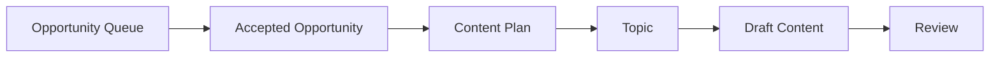
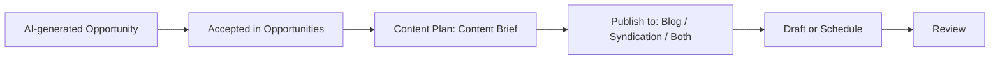

# PRD: CiteLoop Content Plan Brief-First Redesign

> Date: 2026-07-06
> Scope: Content Plan, Opportunity handoff, content drafting strategy
> Status: Draft for PM review

## 1. Summary

Content Plan should become a content-brief workbench, not a page that asks users to manage both accepted opportunities and backend Topics.

The target model is:

- Opportunities page is the triage surface for AI-generated growth work.
- Queue destination keeps its existing meaning: Content Plan, Site Fixes, Results, or Review.
- Doctor creates immediately verifiable Site Fixes.
- Accepted AI-generated, content-producing Opportunities go to Content Plan as Content Briefs.
- Content Plan's primary queue is Content Briefs.
- Every newly created Content Brief retains its accepted source Opportunity.
- Each Content Brief has a publish strategy: Blog, Syndication, or Both.
- AI recommends a publish strategy and preselects it as the default.
- Users can override the publish strategy in the Content Brief drawer before drafting.
- Backend Topic can remain an internal generation and scheduling object, but it should no longer be a primary user-facing object on Content Plan.

This removes the confusing "Planned topics" layer from Content Plan and makes the page match the user's mental model: if it is in Content Plan, it is content that can be drafted, scheduled, or handed off to Review.

## 2. Supersession And Compatibility

This PRD is intended to supersede the Topic-visible direction in `PRD-CiteLoop-Loop-Lifecycle-Content-Plan-UX.md`.

Specifically, this PRD replaces:

- The user-facing "Topic backlog" section.
- The user-facing "Topic planned" lifecycle label.
- Topic cards as the primary Content Plan work item.
- Manual Topic creation as the primary manual creation workflow.
- `/plan?topic=` as the preferred user-facing deep link target for new work.

This PRD does not supersede `PRD-CiteLoop-Workflow-Handoff-Link-Cards.md`.

The handoff card spec remains canonical:

- Content Plan must keep a Sent to Review handoff area.
- The handoff area is required, not optional.
- After this redesign, the handoff should be derived from Content Brief / content action state first, with legacy Topic state used only as a compatibility fallback.

This PRD also changes the routing interpretation from the currently implemented Opportunity queue behavior for some metadata work. Implementation must update the related PRDs and contract tests at the same time so the product rules do not conflict.

### 2.1 2026-07-12 Source-Boundary Update

This update supersedes the original manual-creation direction in this PRD, including the former `New Content Brief` entry point and every related goal, UX, acceptance, test, rollout, and resolved-decision clause.

The current source contract is:

- Doctor and Opportunities are the only user-visible sources of newly created work.
- Doctor creates Site Fixes whose success can be verified immediately.
- A Content Brief can be created only from an accepted AI-generated Opportunity and must retain that Opportunity's ID and AI provenance.
- Content Plan is a downstream execution queue. It does not create a manual Opportunity, Topic, or Content Brief.
- A user may explicitly trigger AI Opportunity Finding, but the resulting records remain AI-generated Opportunities and must pass through the Opportunities acceptance flow before a Content Brief exists.
- Historical source-less Topics remain accessible only through legacy compatibility. They are not migrated or backfilled into Content Briefs, and they do not provide a supported creation entry point.

Where any older statement in this PRD conflicts with this update, this section controls.

## 3. Background

Current behavior exposes two adjacent concepts:

- Accepted opportunities: items accepted from Opportunity Queue.
- Planned topics: generated content planning objects.

In practice, users think accepted opportunities in Content Plan are already content work. Seeing a second Topic layer makes the workflow feel redundant:

1. Opportunity is accepted.
2. It appears in Content Plan.
3. User expects to draft content from it.
4. Page also shows a Topic section.
5. User has to ask why another object is needed.

There is also a separate confusion around publish strategy:

- The user wants to choose whether a content item should publish to Blog, Syndication, or Both.
- Today that choice is not visible in the accepted opportunity drawer.
- Current editing behavior is tied to Topic objects, which are not the right user-facing surface for this decision.

The user-facing model should be simplified: publish strategy belongs to the Content Brief.

## 4. Problem Statement

Content Plan currently mixes product concepts that should not be equally visible:

- Opportunity is the discovery and prioritization object.
- Content Brief is the work item that should be drafted.
- Topic is an internal planning, scheduling, and generation object.

Because Topic is visible on Content Plan, users ask:

- Why do we still need Topic if the accepted opportunity already represents content to create?
- When does an opportunity become a Topic?
- Where do I choose Blog, Syndication, or Both?
- Does canonical content block syndication publishing?
- Why do metadata or site-fix opportunities appear near content drafting?

The page should answer those questions through structure, not documentation.

## 5. Goals

- Remove the user-facing Planned Topics section from Content Plan.
- Make Content Briefs the primary Content Plan queue.
- Make every newly created Content Plan item an accepted AI-generated Opportunity-derived Content Brief.
- Keep historical source-less Topics available only through legacy compatibility, outside the current-work source contract.
- Route immediately verifiable work through Doctor to Site Fixes before it reaches Content Plan.
- Add a clear Publish to selector in the Content Brief drawer.
- Let AI recommend Blog, Syndication, or Both with a short reason.
- Use the AI recommendation as the default selection.
- Allow users to override the recommendation before drafting.
- Preserve scheduling by moving it from Topic cards to Content Brief cards/drawers.
- Enforce accepted AI-generated Opportunity provenance for every newly created Content Brief.
- Preserve Sent to Review handoff cards.
- Preserve backend flexibility to keep Topic as an internal record.

## 6. Non-Goals

- This PRD does not redesign the full Opportunities page.
- This PRD does not define the final publishing scheduler UI beyond carrying forward existing schedule, cancel, and reschedule capabilities.
- This PRD does not change the full article editor experience.
- This PRD does not require removing Topic from the database.
- This PRD does not require changing external platform publishing integrations.
- This PRD does not remove historical generated content.

## 7. Product Decision

### 7.1 Content Plan Owns Content Briefs

Content Plan should display Content Briefs, not backend Topics.

User-facing naming:

| Current term | Proposed user-facing term | Notes |
| --- | --- | --- |
| Topic | Content Brief | Use for Opportunity-derived current work in Content Plan; legacy compatibility retains historical records without conversion. |
| Channel | Publish to / 发布渠道 | Use when selecting Blog / Syndication / Both. |
| Canonical | Source Article / 主站原文 | Use for owned-site article. |
| Syndication | Distribution Draft / 内容分发 | Use for external-platform variants. |
| Content Action | Content Brief | Avoid exposing implementation language. |
| Topic planned | Preparing draft | Use lifecycle language from the brief perspective. |

### 7.2 Topic Becomes Internal

Backend Topic can still exist for generation, writer prompts, scheduling, and publish-state tracking.

However:

- Users should not have to create or manage new Topic objects.
- Users should not need to understand when a Topic is created.
- The Topic's channel should be derived from the Content Brief's publish strategy.
- Topic creation should happen behind the scenes when drafting starts, when a brief is scheduled, or when automation picks up the brief.
- New UI should deep-link to the Content Brief, not to Topic, whenever both identifiers exist.

### 7.3 Accepted AI-Generated Opportunity Equals Content Brief

Once an accepted AI-generated, content-producing Opportunity enters Content Plan, it should already be a Content Brief with a durable source Opportunity reference.

That means:

- Content Plan should not show pure technical fixes.
- Content Plan should not show internal-link-only patches unless they create or refresh content.
- Content Plan should not ask the user to create another Topic manually.
- Content Plan should not accept a source-less or user-authored Opportunity/Brief record.
- Historical Topics without a source Opportunity or content action remain legacy compatibility records; they are not migrated into Content Briefs.

## 8. Routing Rules

AI-generated candidate ownership and Opportunity acceptance should route work into the correct queue.

This PRD resolves metadata routing as follows:

| Candidate / work type | Required source and queue destination | Reason |
| --- | --- | --- |
| New article, comparison page, guide, glossary, landing page, or supporting section | Accepted AI-generated Opportunity -> Content Plan | Requires content creation and delayed growth measurement. |
| Existing page expansion or content refresh | Accepted AI-generated Opportunity -> Content Plan | Requires editorial content drafting and delayed growth measurement. |
| Metadata or title/meta rewrite that is part of an editorial page refresh | Accepted AI-generated Opportunity -> Content Plan | Requires page context, editorial judgment, and delayed growth measurement. |
| Pure mechanical metadata patch with no editorial judgment | Doctor finding -> Site Fixes | Direct, immediately verifiable fix, not a Content Brief. |
| Schema patch | Doctor finding -> Site Fixes | Immediately verifiable technical/site enhancement. |
| Sitemap update | Doctor finding -> Site Fixes | Immediately verifiable technical/site enhancement. |
| Robots, canonical tag, crawler, indexing issue | Doctor finding -> Site Fixes | Immediately verifiable technical SEO fix. |
| Internal-link-only patch | Doctor finding -> Site Fixes | Direct site improvement unless a separate AI-generated Opportunity proposes content creation or refresh. |

PM rule:

> If an item appears in Content Plan, the user should be able to draft, schedule, or review content from it.

Every newly created item that satisfies this rule must also trace to an accepted AI-generated Opportunity. Site Fixes trace to Doctor findings instead and never use Content Plan as an intake surface.

Compatibility note:

- Current contract behavior around `metadata_rewrite` treats metadata work as not routed to Site Fixes.
- This PRD changes that into a split rule.
- Implementation must update the related PRD language and contract tests, including `seo-client-contract.test.mjs:224`.

## 9. Publish Strategy

Each Content Brief has one publish strategy.

Use "Publish to" in UI instead of "Content Destination" so we do not collide with queue destination language used by handoff cards.

| Strategy | Meaning | Expected generated output |
| --- | --- | --- |
| Blog | Create an owned-site source article. | Source article / canonical draft. |
| Syndication | Create external distribution drafts, with an internal source draft generated when needed. | Source draft plus syndication variants; external publish waits for canonical URL in V1. |
| Both | Create owned-site article plus external distribution drafts. | Source article plus syndication variants. |

### 9.1 Default Recommendation

AI should recommend one publish strategy for every Content Brief.

The recommended value should be selected by default, but editable by the user.

UI example:

```text
Publish to

[ Blog ] [ Syndication ] [ Both ]

Recommended: Both
Reason: This query can support an owned article and short external distribution drafts.
```

### 9.2 Recommendation Heuristics

V1 recommendation logic can use deterministic heuristics plus AI explanation.

| Signal | Recommended strategy |
| --- | --- |
| Existing page needs a substantial content refresh | Blog |
| New SEO page, guide, comparison, glossary, or supporting section | Both |
| Community/discussion intent or platform-specific angle | Syndication |
| Announcement-like or thought-leadership oriented topic | Both |
| Owned-site authority plus external reach both matter | Both |
| Unclear or low confidence | Blog |

Tie-break rule:

- If a signal could be either Syndication or Both, default to Both unless there is no owned-site value.

The UI should show confidence lightly through copy, not as a heavy scoring system.

Recommended copy:

- "Recommended"
- "AI recommendation"
- "Suggested publish strategy"

Avoid:

- "Required"
- "Locked"
- "System-decided"

## 10. Canonical And Syndication Ordering

V1 decision:

- Syndication publish requires a canonical/source URL first.
- For `Syndication`, the generation layer still creates or references a source draft internally.
- For `Both`, the source article and syndication variants are generated together.
- External syndication publishing is blocked until the canonical/source article is published and has a URL.

Product explanation:

> Syndication should not feel blocked by an invisible Topic step. If a source article is required technically, the UI should explain it as part of the publishing sequence: first publish the source article, then publish distribution drafts that reference it.

This closes former open questions about whether Syndication should generate a source draft and whether canonical/source publishing is a hard prerequisite.

## 11. Content Plan UX

### 11.1 Page Structure

Proposed Content Plan structure:

1. Page header and automation controls.
2. Content Briefs queue.
3. Sent to Review handoff area.

The Sent to Review handoff area is required, not optional.

Remove from this page:

- Planned Topics section.
- Topic cards as a separate queue.
- Manual Topic editing as a primary workflow.

Replace with:

- Content Brief cards.
- Content Brief drawer.
- Open Opportunities entry point for finding and accepting new content work.
- Schedule controls on Content Brief cards/drawers.

### 11.2 Content Brief Card

Each card should show:

- Status.
- Brief title.
- Target URL or target query.
- Work type.
- Publish strategy.
- AI recommendation badge when applicable.
- Draft status.
- Scheduled time when applicable.

Example card metadata:

```text
Accepted
Create a supporting section for the query intent
Target URL: https://example.com/
Publish to: Both · Recommended
Status: Ready to draft
```

### 11.3 Content Brief Drawer

The drawer should contain:

- Brief title.
- Why write this.
- SEO / GEO contribution.
- Target query.
- Target URL.
- Evidence source.
- Work type.
- Publish to selector: Blog, Syndication, Both.
- AI recommendation reason.
- Schedule, cancel, and reschedule controls when available.
- Primary CTA: Draft Content.
- Secondary action: Dismiss or return to queue.

The publish selector should be available before the user clicks Draft Content.

### 11.4 Draft Content CTA

When the user clicks Draft Content:

1. Save the current publish strategy.
2. Create or update the internal Topic/generation object if needed.
3. Generate the appropriate draft outputs.
4. Move the item to Review.
5. Update the Sent to Review handoff card.

If the item does not create content, Draft Content should not appear.

### 11.5 Scheduling

Removing Topic cards must not remove scheduling.

V1 decision:

- Content Brief cards/drawers inherit schedule, cancel, and reschedule controls.
- Existing scheduled Topics that already link to an accepted Opportunity-derived action can appear through that linked Content Brief without rewriting provenance.
- Source-less scheduled Topics remain in the labeled legacy compatibility surface and are not converted into Content Briefs.
- An already persisted legacy schedule may complete only its existing Topic; it cannot create, clone, or seed another Topic or Content Brief, and it must remain visible in the legacy compatibility surface.
- The scheduler can continue to use Topic internally, but the user-facing object for Opportunity-derived current work is the Content Brief; the legacy compatibility surface remains explicitly historical.

### 11.6 New-Work Source Boundary

Content Plan does not create new work.

V1 decision:

- Every newly created Content Brief must have an accepted AI-generated source Opportunity.
- Content Plan exposes no Topic, Opportunity, or Content Brief creation form or API contract.
- The only new-work CTA from Content Plan opens Opportunities; the user accepts an AI-generated Opportunity there before returning to Content Plan.
- A user-triggered AI Opportunity Finding run is allowed, but it creates AI-generated candidates in Opportunities rather than creating a Content Brief directly.
- Historical source-less Topics remain available through legacy compatibility only and cannot be copied, converted, or reused to seed future Content Briefs.
- If the backend needs a Topic for an Opportunity-derived Content Brief, it creates that Topic internally after the Content Brief exists.

## 12. Lifecycle Labels

Because Topic is no longer user-facing for current-source work, lifecycle labels in the current queue must describe the Content Brief state.

| Old label | New label | Meaning |
| --- | --- | --- |
| Topic backlog | Ready to draft | Brief exists and can be drafted. |
| Topic planned | Preparing draft | Internal generation/planning is queued or in progress. |
| Scheduled | Scheduled | Brief has a scheduled draft time. |
| Drafted | Sent to Review | Draft exists and should be reviewed. |
| Published | Published | Content has been published. |

Do not show "Topic planned" in the current-work queue after this redesign. A legacy compatibility view may preserve historical state labels when required to interpret an existing record.

## 13. Handoff Behavior

Content Plan must keep the Sent to Review handoff card.

New derivation order:

1. Prefer Content Brief / content action fields such as `draft_article_id` and `draft_article_status`.
2. Fall back to Topic state for legacy drafts.
3. Preserve existing handoff link-card behavior and copy from the canonical handoff PRD.

The card should link to the Review surface, not to a legacy Topic card.

## 14. Current vs Proposed Flow

### 14.1 Current Mental Model



Problem: users do not understand why D exists as a separate visible step.

### 14.2 Proposed Mental Model



Immediately verifiable work follows the separate `Doctor -> Site Fixes -> Verification` line and never becomes a Content Brief. This makes both user-facing workflows linear and predictable.

## 15. API And Data Requirements

### 15.1 Content Brief Fields

Content Briefs should support:

- `publish_strategy`: `blog`, `syndication`, or `both`.
- `publish_strategy_recommendation`: AI/default recommendation.
- `publish_strategy_reason`: short explanation shown in drawer.
- `publish_strategy_overridden`: boolean.
- `publish_strategy_overridden_at`: timestamp.
- `publish_strategy_overridden_by`: user ID if available.
- `scheduled_at`: timestamp when scheduled drafting is active.
- `source_topic_id`: legacy/internal topic ID if one exists.

These fields may live on the content action record or a related content brief record. Product requirement is user behavior; engineering can choose the storage shape.

### 15.2 Internal Topic Mapping

When an internal Topic is created from a Content Brief:

- `topic.channel` should map from `publish_strategy`.
- `blog` maps to `blog`.
- `syndication` maps to `syndication`.
- `both` maps to `both`.
- It should not default to `blog` for all opportunity-generated work.
- It should retain a reference back to the source Content Brief.
- Changing publish strategy before drafting should affect the generated outputs.

Known code risks to cover:

- Opportunity-generated Topic creation currently hardcodes `Channel: "blog"` in `handlers_seo.go`.
- Scheduled Topic creation currently hardcodes `Channel: "blog"` in `scheduler.go`.
- Implementation must fix both paths, not only the interactive draft path.

### 15.3 Draft Generation Behavior

| Publish strategy | Generation behavior |
| --- | --- |
| Blog | Generate source article / canonical draft. |
| Syndication | Generate source draft plus syndication variants; external publish waits for source URL. |
| Both | Generate source article plus syndication variants. |

### 15.4 Legacy Topic Compatibility (No Migration)

The source-boundary rollout preserves existing records without turning them into current-source Content Briefs:

- Existing Topics with linked content actions can be rendered through their linked Content Brief without changing source provenance.
- Existing scheduled Topics remain visible with cancel and reschedule controls through a clearly labeled legacy compatibility surface.
- Existing drafted Topics continue to appear through Sent to Review handoff.
- Historical source-less Topics, including former strategist-created records, are not backfilled, converted, or migrated into Content Briefs.
- A source-less Topic may remain readable and may expose only the controls needed to complete, dismiss, or archive that existing record. It cannot create or seed new work.
- Advancing or completing that pre-existing record is compatibility behavior, not a new source record; no compatibility action may clone it or create another Topic, Opportunity, or Content Brief.
- Legacy Topic records are excluded from current-source Content Brief counts and source-integrity metrics.

The compatibility layer can continue to read the existing `topic.channel` values `blog`, `syndication`, and `both`; this does not authorize a new Topic entry point.

## 16. Automation Behavior

When automation is on:

1. An AI-generated candidate passes ownership arbitration.
2. Immediately verifiable work enters Doctor and creates a Site Fix; it does not continue through this Content Plan flow.
3. A content-producing Growth candidate enters Opportunities and is accepted.
4. The accepted Opportunity creates a Content Brief in Content Plan with durable source provenance.
5. AI assigns a recommended publish strategy.
6. Automation drafts content using the saved recommendation unless the user overrides it before automation runs.

Race-condition decision:

- If Auto is on, the AI recommendation is the committed default.
- Automation may draft immediately with that recommendation.
- This matches the existing automation posture.
- Users who need to manually choose publish strategy should disable Auto or change the strategy before the automation run.
- A future override window can be considered, but it is not required for V1.

If automation runs before user review, the generated content should still preserve the recommendation reason for auditability.

## 17. Empty And Edge States

### 17.1 No Content Briefs

Empty state copy:

```text
No content briefs yet
Review AI-generated content opportunities in Opportunities and accept one to start work.
```

Primary action: `Open Opportunities`.

### 17.2 Incorrectly Routed Work

If a record does not satisfy the content-producing Opportunity contract, fail closed instead of creating a Content Brief.

If it happens:

- Do not show Draft Content.
- Return the record to ownership arbitration.
- If it is immediately verifiable work, show that Doctor owns it and link to the corresponding Doctor finding or Site Fix.

### 17.3 Recommendation Missing

If AI recommendation is missing:

- Default to Blog.
- Show neutral copy: "Default publish strategy".
- Allow user override.

## 18. Copy Guidelines

Use product language that matches the simplified workflow.

Formal terminology:

| Concept | English UI | Chinese meaning |
| --- | --- | --- |
| Content work item | Content Brief | 内容需求 / 内容 Brief |
| Publish channel choice | Publish to | 发布渠道 |
| Owned-site source article | Source Article | 主站原文 |
| Canonical reference | Canonical URL | 规范原文链接 |
| External platform distribution | Syndication / Distribution Draft | 内容分发 |
| Queue destination | Destination | 队列去向 |

Avoid:

| Avoid | Prefer |
| --- | --- |
| Topic type | Publish to |
| Planned topic | Content Brief |
| Generate topic | Draft content |
| Channel | Publish strategy |
| Content destination | Publish to |

The drawer should not explain backend concepts. It should help the user decide what output they want.

## 19. Acceptance Criteria

- Content Plan no longer shows a separate current-work Planned Topics section after rollout.
- Content Plan's primary list is Content Briefs.
- Content Plan includes a required Sent to Review handoff area.
- Doctor and Opportunities are the only user-visible sources of newly created work.
- Every newly created Content Brief traces to an accepted AI-generated Opportunity.
- Content Plan exposes no manual Opportunity, Topic, or Content Brief intake.
- Immediately verifiable work originates in Doctor and is routed to Site Fixes.
- Metadata routing follows the split rule: an accepted AI-generated editorial refresh Opportunity goes to Content Plan; a pure mechanical metadata patch originates in Doctor and goes to Site Fixes.
- Every current-source item in Content Plan can be drafted, scheduled, or reviewed as content.
- Content Brief drawer includes Blog, Syndication, and Both under Publish to.
- AI recommendation is visible in the drawer.
- AI recommendation is selected by default.
- User can override publish strategy before drafting.
- Draft Content uses the selected publish strategy.
- Internal Topic channel is derived from selected publish strategy.
- Opportunity-generated content no longer hardcodes `blog` in the handler path.
- Scheduled content generation no longer hardcodes `blog` in the scheduler path.
- Doctor findings and Site Fixes do not appear as Content Briefs.
- Review handoff still works after drafting.
- Existing scheduled Topics remain visible and cancellable/reschedulable through legacy compatibility.
- Historical source-less Topics remain accessible without migration and cannot seed any future Content Brief.
- A user-triggered AI Opportunity Finding run creates AI-generated candidates in Opportunities and does not bypass acceptance.
- Existing generated content remains accessible and is not deleted by this UI simplification.

## 20. Test Plan

### 20.1 Product Flow Tests

- Accept an AI-generated content Opportunity and confirm it appears in Content Plan as a Content Brief with source provenance.
- Run Doctor against a pure mechanical metadata issue and confirm the Doctor finding creates a Site Fix without creating an Opportunity or Content Brief.
- Accept an AI-generated editorial metadata/page refresh Opportunity and confirm it appears in Content Plan.
- Open a Content Brief drawer and confirm Publish to selector is visible.
- Confirm AI recommendation is preselected.
- Change publish strategy and draft content.
- Confirm generated output matches selected publish strategy.
- Schedule a Content Brief and confirm it remains visible with cancel/reschedule controls.
- Confirm a drafted item updates the Sent to Review handoff card.

### 20.2 Regression Tests

- Existing accepted content actions still load.
- Existing Topic-backed drafts still appear in Review or editor surfaces.
- Existing scheduled Topics are visible through the legacy compatibility surface.
- Auto workflow can still draft content.
- Content Plan has no manual Topic, Opportunity, or Content Brief creation entry point.
- A user-triggered AI Opportunity Finding run produces an AI-generated Opportunity; only acceptance creates the downstream Content Brief.
- A historical source-less Topic remains accessible but is not migrated, copied, or counted as a current-source Content Brief.
- Non-content actions cannot trigger content generation.

### 20.3 Contract Tests To Update

Implementation should review and update at least:

- `seo-client-contract.test.mjs`, especially metadata routing around `metadata_rewrite`.
- `visibility-summary-contract.test.mjs`, especially any Topic/client visibility assertions.
- `workflow-handoff-link-cards-contract.test.mjs`, especially handoff derivation from Topic state.
- `dashboard-ux-phase1-contract.test.mjs`, if dashboard counts or queue names depend on Topic visibility.

## 21. Rollout Plan

Recommended rollout:

1. Apply the 2026-07-12 source boundary and update PRD references so it supersedes both the Topic-visible sections of the Loop Lifecycle PRD and this PRD's former manual-creation direction.
2. Add or map Content Brief publish strategy fields and defaults.
3. Add the split metadata routing rule.
4. Update contract tests to match the new routing and handoff rules.
5. Backfill existing accepted content actions with a publish strategy recommendation.
6. Render linked Topics through their Opportunity-derived Content Briefs without rewriting source provenance.
7. Keep scheduled and source-less historical Topics visible through a labeled legacy compatibility surface without migrating them.
8. Add Publish to selector to the Content Brief drawer.
9. Update draft generation to use selected publish strategy.
10. Fix both known `Channel: "blog"` hardcoded opportunity/scheduler paths.
11. Remove Topic, Opportunity, and Content Brief creation entry points from Content Plan and point its new-work CTA only to Opportunities.
12. Hide Planned Topics from the current-work queue while preserving legacy Topic access.
13. Preserve and rewire Sent to Review handoff cards to prefer Content Brief / content action state.
14. Keep old Topic route/data readable for backward compatibility during rollout.
15. Remove or hide legacy strategist/topic entry points from primary navigation.

## 22. Resolved Decisions

- `Syndication` generates or references a source draft internally in V1.
- External syndication publish is blocked until the source/canonical URL exists in V1.
- If publish strategy recommendation is missing, default to Blog.
- If a recommendation signal could be Syndication or Both, default to Both.
- Auto mode may draft with the AI recommendation before a user override.
- Content Plan must keep Sent to Review handoff cards.
- Every newly created Content Brief must come from an accepted AI-generated Opportunity; Content Plan has no manual creation path.
- Opportunity-derived scheduling moves to Content Brief UI, while existing source-less Topics retain only legacy compatibility controls.

## 23. Open Questions

1. Should users be able to bulk-apply publish strategy across multiple Content Briefs?
2. Should publish strategy be editable after draft generation but before publish?
3. Should Review show publish strategy badges for generated drafts?
4. Should the English UI use "Syndication" or "Distribution" for broader clarity?
