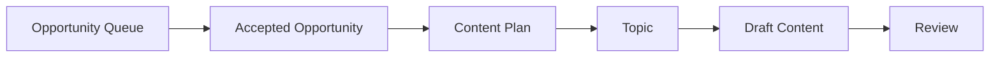
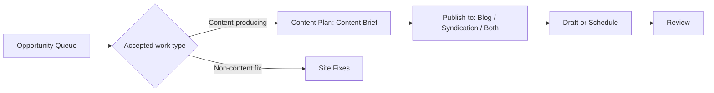

# PRD: CiteLoop Content Plan Brief-First Redesign

> Date: 2026-07-06
> Scope: Content Plan, Opportunity handoff, content drafting strategy
> Status: Draft for PM review

## 1. Summary

Content Plan should become a content-brief workbench, not a page that asks users to manage both accepted opportunities and backend Topics.

The target model is:

- Opportunities page is the triage surface.
- Queue destination keeps its existing meaning: Content Plan, Site Fixes, Results, or Review.
- Non-content work goes to Site Fixes.
- Content-producing opportunities go to Content Plan as Content Briefs.
- Content Plan's primary queue is Content Briefs.
- Each Content Brief has a publish strategy: Blog, Syndication, or Both.
- AI recommends a publish strategy and preselects it as the default.
- Users can override the publish strategy in the Content Brief drawer before drafting.
- Backend Topic can remain an internal generation and scheduling object, but it should no longer be a primary user-facing object on Content Plan.

This removes the confusing "Planned topics" layer from Content Plan and makes the page match the user's mental model: if it is in Content Plan, it is content that can be drafted, scheduled, or handed off to Review.

## 2. Supersession And Compatibility

This PRD is intended to supersede the Topic-visible direction in `PRD-CiteLoop-Loop-Lifecycle-Content-Plan-UX.md`.

Specifically, this PRD replaces:

- The user-facing "Topic backlog" section.
- The user-facing "Topic planned" lifecycle label.
- Topic cards as the primary Content Plan work item.
- Manual Topic creation as the primary manual creation workflow.
- `/plan?topic=` as the preferred user-facing deep link target for new work.

This PRD does not supersede `PRD-CiteLoop-Workflow-Handoff-Link-Cards.md`.

The handoff card spec remains canonical:

- Content Plan must keep a Sent to Review handoff area.
- The handoff area is required, not optional.
- After this redesign, the handoff should be derived from Content Brief / content action state first, with legacy Topic state used only as a compatibility fallback.

This PRD also changes the routing interpretation from the currently implemented Opportunity queue behavior for some metadata work. Implementation must update the related PRDs and contract tests at the same time so the product rules do not conflict.

## 3. Background

Current behavior exposes two adjacent concepts:

- Accepted opportunities: items accepted from Opportunity Queue.
- Planned topics: generated content planning objects.

In practice, users think accepted opportunities in Content Plan are already content work. Seeing a second Topic layer makes the workflow feel redundant:

1. Opportunity is accepted.
2. It appears in Content Plan.
3. User expects to draft content from it.
4. Page also shows a Topic section.
5. User has to ask why another object is needed.

There is also a separate confusion around publish strategy:

- The user wants to choose whether a content item should publish to Blog, Syndication, or Both.
- Today that choice is not visible in the accepted opportunity drawer.
- Current editing behavior is tied to Topic objects, which are not the right user-facing surface for this decision.

The user-facing model should be simplified: publish strategy belongs to the Content Brief.

## 4. Problem Statement

Content Plan currently mixes product concepts that should not be equally visible:

- Opportunity is the discovery and prioritization object.
- Content Brief is the work item that should be drafted.
- Topic is an internal planning, scheduling, and generation object.

Because Topic is visible on Content Plan, users ask:

- Why do we still need Topic if the accepted opportunity already represents content to create?
- When does an opportunity become a Topic?
- Where do I choose Blog, Syndication, or Both?
- Does canonical content block syndication publishing?
- Why do metadata or site-fix opportunities appear near content drafting?

The page should answer those questions through structure, not documentation.

## 5. Goals

- Remove the user-facing Planned Topics section from Content Plan.
- Make Content Briefs the primary Content Plan queue.
- Make every item in Content Plan a content-producing brief or a migrated legacy content item.
- Route non-content work to Site Fixes before it reaches Content Plan.
- Add a clear Publish to selector in the Content Brief drawer.
- Let AI recommend Blog, Syndication, or Both with a short reason.
- Use the AI recommendation as the default selection.
- Allow users to override the recommendation before drafting.
- Preserve scheduling by moving it from Topic cards to Content Brief cards/drawers.
- Preserve manual creation by replacing manual Topic creation with New Content Brief.
- Preserve Sent to Review handoff cards.
- Preserve backend flexibility to keep Topic as an internal record.

## 6. Non-Goals

- This PRD does not redesign the full Opportunities page.
- This PRD does not define the final publishing scheduler UI beyond carrying forward existing schedule, cancel, and reschedule capabilities.
- This PRD does not change the full article editor experience.
- This PRD does not require removing Topic from the database.
- This PRD does not require changing external platform publishing integrations.
- This PRD does not remove historical generated content.

## 7. Product Decision

### 7.1 Content Plan Owns Content Briefs

Content Plan should display Content Briefs, not backend Topics.

User-facing naming:

| Current term | Proposed user-facing term | Notes |
| --- | --- | --- |
| Topic | Content Brief | Use in Content Plan UI. |
| Channel | Publish to / 发布渠道 | Use when selecting Blog / Syndication / Both. |
| Canonical | Source Article / 主站原文 | Use for owned-site article. |
| Syndication | Distribution Draft / 内容分发 | Use for external-platform variants. |
| Content Action | Content Brief | Avoid exposing implementation language. |
| Topic planned | Preparing draft | Use lifecycle language from the brief perspective. |

### 7.2 Topic Becomes Internal

Backend Topic can still exist for generation, writer prompts, scheduling, and publish-state tracking.

However:

- Users should not have to manually manage Topic objects.
- Users should not need to understand when a Topic is created.
- The Topic's channel should be derived from the Content Brief's publish strategy.
- Topic creation should happen behind the scenes when drafting starts, when a brief is scheduled, or when automation picks up the brief.
- New UI should deep-link to the Content Brief, not to Topic, whenever both identifiers exist.

### 7.3 Accepted Opportunity Equals Content Brief

Once a content-producing opportunity enters Content Plan, it should already be a Content Brief.

That means:

- Content Plan should not show pure technical fixes.
- Content Plan should not show internal-link-only patches unless they create or refresh content.
- Content Plan should not ask the user to create another Topic manually.
- Legacy Topics without a source content action must be migrated into Content Brief-shaped UI records before the Planned Topics section is removed.

## 8. Routing Rules

Opportunity acceptance should route work into the correct queue.

This PRD resolves metadata routing as follows:

| Opportunity / work type | Queue destination | Reason |
| --- | --- | --- |
| New article, comparison page, guide, glossary, landing page, or supporting section | Content Plan | Requires content creation. |
| Existing page expansion or content refresh | Content Plan | Requires editorial content drafting. |
| Metadata or title/meta rewrite that is part of an editorial page refresh | Content Plan | Requires page context and editorial judgment. |
| Pure mechanical metadata patch with no editorial judgment | Site Fixes | Direct fix, not a content draft. |
| Schema patch | Site Fixes | Technical/site enhancement. |
| Sitemap update | Site Fixes | Technical/site enhancement. |
| Robots, canonical tag, crawler, indexing issue | Site Fixes | Technical SEO fix. |
| Internal-link-only patch | Site Fixes | Direct site improvement unless paired with content creation or refresh. |

PM rule:

> If an item appears in Content Plan, the user should be able to draft, schedule, or review content from it.

Compatibility note:

- Current contract behavior around `metadata_rewrite` treats metadata work as not routed to Site Fixes.
- This PRD changes that into a split rule.
- Implementation must update the related PRD language and contract tests, including `seo-client-contract.test.mjs:224`.

## 9. Publish Strategy

Each Content Brief has one publish strategy.

Use "Publish to" in UI instead of "Content Destination" so we do not collide with queue destination language used by handoff cards.

| Strategy | Meaning | Expected generated output |
| --- | --- | --- |
| Blog | Create an owned-site source article. | Source article / canonical draft. |
| Syndication | Create external distribution drafts, with an internal source draft generated when needed. | Source draft plus syndication variants; external publish waits for canonical URL in V1. |
| Both | Create owned-site article plus external distribution drafts. | Source article plus syndication variants. |

### 9.1 Default Recommendation

AI should recommend one publish strategy for every Content Brief.

The recommended value should be selected by default, but editable by the user.

UI example:

```text
Publish to

[ Blog ] [ Syndication ] [ Both ]

Recommended: Both
Reason: This query can support an owned article and short external distribution drafts.
```

### 9.2 Recommendation Heuristics

V1 recommendation logic can use deterministic heuristics plus AI explanation.

| Signal | Recommended strategy |
| --- | --- |
| Existing page needs a substantial content refresh | Blog |
| New SEO page, guide, comparison, glossary, or supporting section | Both |
| Community/discussion intent or platform-specific angle | Syndication |
| Announcement-like or thought-leadership oriented topic | Both |
| Owned-site authority plus external reach both matter | Both |
| Unclear or low confidence | Blog |

Tie-break rule:

- If a signal could be either Syndication or Both, default to Both unless there is no owned-site value.

The UI should show confidence lightly through copy, not as a heavy scoring system.

Recommended copy:

- "Recommended"
- "AI recommendation"
- "Suggested publish strategy"

Avoid:

- "Required"
- "Locked"
- "System-decided"

## 10. Canonical And Syndication Ordering

V1 decision:

- Syndication publish requires a canonical/source URL first.
- For `Syndication`, the generation layer still creates or references a source draft internally.
- For `Both`, the source article and syndication variants are generated together.
- External syndication publishing is blocked until the canonical/source article is published and has a URL.

Product explanation:

> Syndication should not feel blocked by an invisible Topic step. If a source article is required technically, the UI should explain it as part of the publishing sequence: first publish the source article, then publish distribution drafts that reference it.

This closes former open questions about whether Syndication should generate a source draft and whether canonical/source publishing is a hard prerequisite.

## 11. Content Plan UX

### 11.1 Page Structure

Proposed Content Plan structure:

1. Page header and automation controls.
2. Content Briefs queue.
3. Sent to Review handoff area.

The Sent to Review handoff area is required, not optional.

Remove from this page:

- Planned Topics section.
- Topic cards as a separate queue.
- Manual Topic editing as a primary workflow.

Replace with:

- Content Brief cards.
- Content Brief drawer.
- New Content Brief entry point.
- Schedule controls on Content Brief cards/drawers.

### 11.2 Content Brief Card

Each card should show:

- Status.
- Brief title.
- Target URL or target query.
- Work type.
- Publish strategy.
- AI recommendation badge when applicable.
- Draft status.
- Scheduled time when applicable.

Example card metadata:

```text
Accepted
Create a supporting section for the query intent
Target URL: https://example.com/
Publish to: Both · Recommended
Status: Ready to draft
```

### 11.3 Content Brief Drawer

The drawer should contain:

- Brief title.
- Why write this.
- SEO / GEO contribution.
- Target query.
- Target URL.
- Evidence source.
- Work type.
- Publish to selector: Blog, Syndication, Both.
- AI recommendation reason.
- Schedule, cancel, and reschedule controls when available.
- Primary CTA: Draft Content.
- Secondary action: Dismiss or return to queue.

The publish selector should be available before the user clicks Draft Content.

### 11.4 Draft Content CTA

When the user clicks Draft Content:

1. Save the current publish strategy.
2. Create or update the internal Topic/generation object if needed.
3. Generate the appropriate draft outputs.
4. Move the item to Review.
5. Update the Sent to Review handoff card.

If the item does not create content, Draft Content should not appear.

### 11.5 Scheduling

Removing Topic cards must not remove scheduling.

V1 decision:

- Content Brief cards/drawers inherit schedule, cancel, and reschedule controls.
- Existing scheduled Topics must appear as scheduled Content Briefs before the Planned Topics section is removed.
- No scheduled Topic may continue auto-drafting without a visible Content Plan surface.
- The scheduler can continue to use Topic internally, but the user-facing object is the Content Brief.

### 11.6 Manual Creation

Removing manual Topic creation must not remove manual creation.

V1 decision:

- Content Plan gets a New Content Brief entry point.
- Manually created briefs use the same Publish to selector and Draft Content flow as opportunity-derived briefs.
- If backend still creates a Topic, it does so internally after the Content Brief exists.

## 12. Lifecycle Labels

Because Topic is no longer user-facing, lifecycle labels must describe the Content Brief state.

| Old label | New label | Meaning |
| --- | --- | --- |
| Topic backlog | Ready to draft | Brief exists and can be drafted. |
| Topic planned | Preparing draft | Internal generation/planning is queued or in progress. |
| Scheduled | Scheduled | Brief has a scheduled draft time. |
| Drafted | Sent to Review | Draft exists and should be reviewed. |
| Published | Published | Content has been published. |

Do not show "Topic planned" to users after this redesign.

## 13. Handoff Behavior

Content Plan must keep the Sent to Review handoff card.

New derivation order:

1. Prefer Content Brief / content action fields such as `draft_article_id` and `draft_article_status`.
2. Fall back to Topic state for migrated or legacy drafts.
3. Preserve existing handoff link-card behavior and copy from the canonical handoff PRD.

The card should link to the Review surface, not to a legacy Topic card.

## 14. Current vs Proposed Flow

### 14.1 Current Mental Model



Problem: users do not understand why D exists as a separate visible step.

### 14.2 Proposed Mental Model



This makes the user-facing workflow linear and predictable.

## 15. API And Data Requirements

### 15.1 Content Brief Fields

Content Briefs should support:

- `publish_strategy`: `blog`, `syndication`, or `both`.
- `publish_strategy_recommendation`: AI/default recommendation.
- `publish_strategy_reason`: short explanation shown in drawer.
- `publish_strategy_overridden`: boolean.
- `publish_strategy_overridden_at`: timestamp.
- `publish_strategy_overridden_by`: user ID if available.
- `scheduled_at`: timestamp when scheduled drafting is active.
- `source_topic_id`: legacy/internal topic ID if one exists.

These fields may live on the content action record or a related content brief record. Product requirement is user behavior; engineering can choose the storage shape.

### 15.2 Internal Topic Mapping

When an internal Topic is created from a Content Brief:

- `topic.channel` should map from `publish_strategy`.
- `blog` maps to `blog`.
- `syndication` maps to `syndication`.
- `both` maps to `both`.
- It should not default to `blog` for all opportunity-generated work.
- It should retain a reference back to the source Content Brief.
- Changing publish strategy before drafting should affect the generated outputs.

Known code risks to cover:

- Opportunity-generated Topic creation currently hardcodes `Channel: "blog"` in `handlers_seo.go`.
- Scheduled Topic creation currently hardcodes `Channel: "blog"` in `scheduler.go`.
- Implementation must fix both paths, not only the manual draft path.

### 15.3 Draft Generation Behavior

| Publish strategy | Generation behavior |
| --- | --- |
| Blog | Generate source article / canonical draft. |
| Syndication | Generate source draft plus syndication variants; external publish waits for source URL. |
| Both | Generate source article plus syndication variants. |

### 15.4 Legacy Topic Migration

Before hiding Planned Topics:

- Existing Topics with linked content actions should be shown through the linked Content Brief.
- Existing scheduled Topics should become scheduled Content Briefs with visible schedule controls.
- Existing drafted Topics should continue to appear through Sent to Review handoff.
- Existing manual or strategist Topics without content actions should be backfilled as manual Content Briefs when possible.
- If a legacy Topic cannot be backfilled safely, show it in a temporary legacy read-only section until it is drafted, dismissed, or migrated.

The migration is low risk for publish strategy because existing `topic.channel` already has the same conceptual values: `blog`, `syndication`, and `both`.

## 16. Automation Behavior

When automation is on:

1. Opportunity is accepted.
2. System decides whether it is content-producing or non-content.
3. Non-content work goes to Site Fixes.
4. Content-producing work goes to Content Plan as a Content Brief.
5. AI assigns a recommended publish strategy.
6. Automation drafts content using the saved recommendation unless the user overrides it before automation runs.

Race-condition decision:

- If Auto is on, the AI recommendation is the committed default.
- Automation may draft immediately with that recommendation.
- This matches the existing automation posture.
- Users who need to manually choose publish strategy should disable Auto or change the strategy before the automation run.
- A future override window can be considered, but it is not required for V1.

If automation runs before user review, the generated content should still preserve the recommendation reason for auditability.

## 17. Empty And Edge States

### 17.1 No Content Briefs

Empty state copy:

```text
No content briefs yet
Accept content opportunities from the Opportunity Queue or create a new content brief.
```

### 17.2 Accepted Opportunity Is Not Content

This should be rare after routing improvements.

If it happens:

- Do not show Draft Content.
- Show "Sent to Site Fixes" or "This is a site fix".
- Provide a link to the Site Fixes queue.

### 17.3 Recommendation Missing

If AI recommendation is missing:

- Default to Blog.
- Show neutral copy: "Default publish strategy".
- Allow user override.

## 18. Copy Guidelines

Use product language that matches the simplified workflow.

Formal terminology:

| Concept | English UI | Chinese meaning |
| --- | --- | --- |
| Content work item | Content Brief | 内容需求 / 内容 Brief |
| Publish channel choice | Publish to | 发布渠道 |
| Owned-site source article | Source Article | 主站原文 |
| Canonical reference | Canonical URL | 规范原文链接 |
| External platform distribution | Syndication / Distribution Draft | 内容分发 |
| Queue destination | Destination | 队列去向 |

Avoid:

| Avoid | Prefer |
| --- | --- |
| Topic type | Publish to |
| Planned topic | Content Brief |
| Generate topic | Draft content |
| Channel | Publish strategy |
| Content destination | Publish to |

The drawer should not explain backend concepts. It should help the user decide what output they want.

## 19. Acceptance Criteria

- Content Plan no longer shows a separate Planned Topics section after migration.
- Content Plan's primary list is Content Briefs.
- Content Plan includes a required Sent to Review handoff area.
- Non-content accepted opportunities are routed to Site Fixes.
- Metadata routing follows the split rule: editorial metadata refresh to Content Plan, pure mechanical metadata patch to Site Fixes.
- Every item in Content Plan can be drafted, scheduled, or reviewed as content.
- Content Brief drawer includes Blog, Syndication, and Both under Publish to.
- AI recommendation is visible in the drawer.
- AI recommendation is selected by default.
- User can override publish strategy before drafting.
- Draft Content uses the selected publish strategy.
- Internal Topic channel is derived from selected publish strategy.
- Opportunity-generated content no longer hardcodes `blog` in the handler path.
- Scheduled content generation no longer hardcodes `blog` in the scheduler path.
- Site-fix opportunities do not appear as Content Briefs.
- Review handoff still works after drafting.
- Existing scheduled Topics remain visible and cancellable/reschedulable after migration.
- Existing manual Topic creation is replaced by New Content Brief.
- Existing generated content remains accessible and is not deleted by this UI simplification.

## 20. Test Plan

### 20.1 Product Flow Tests

- Accept a content opportunity and confirm it appears in Content Plan as a Content Brief.
- Accept a pure mechanical metadata opportunity and confirm it appears in Site Fixes.
- Accept an editorial metadata/page refresh opportunity and confirm it appears in Content Plan.
- Open a Content Brief drawer and confirm Publish to selector is visible.
- Confirm AI recommendation is preselected.
- Change publish strategy and draft content.
- Confirm generated output matches selected publish strategy.
- Schedule a Content Brief and confirm it remains visible with cancel/reschedule controls.
- Confirm a drafted item updates the Sent to Review handoff card.

### 20.2 Regression Tests

- Existing accepted content actions still load.
- Existing Topic-backed drafts still appear in Review or editor surfaces.
- Existing scheduled Topics are visible through Content Brief UI.
- Auto workflow can still draft content.
- Manual New Content Brief can still create content without exposing Topic.
- Non-content actions cannot trigger content generation.

### 20.3 Contract Tests To Update

Implementation should review and update at least:

- `seo-client-contract.test.mjs`, especially metadata routing around `metadata_rewrite`.
- `visibility-summary-contract.test.mjs`, especially any Topic/client visibility assertions.
- `workflow-handoff-link-cards-contract.test.mjs`, especially handoff derivation from Topic state.
- `dashboard-ux-phase1-contract.test.mjs`, if dashboard counts or queue names depend on Topic visibility.

## 21. Rollout Plan

Recommended rollout:

1. Update PRD references so this spec supersedes the Topic-visible sections of the Loop Lifecycle PRD.
2. Add or map Content Brief publish strategy fields and defaults.
3. Add the split metadata routing rule.
4. Update contract tests to match the new routing and handoff rules.
5. Backfill existing accepted content actions with a publish strategy recommendation.
6. Migrate linked Topics into Content Brief-shaped UI records.
7. Migrate scheduled Topics so schedule, cancel, and reschedule controls are visible on Content Briefs.
8. Backfill manual/strategist legacy Topics as manual Content Briefs where safe.
9. Add Publish to selector to the Content Brief drawer.
10. Update draft generation to use selected publish strategy.
11. Fix both known `Channel: "blog"` hardcoded opportunity/scheduler paths.
12. Add New Content Brief manual creation.
13. Update Content Plan UI to hide Planned Topics only after migration is complete.
14. Preserve and rewire Sent to Review handoff cards to prefer Content Brief / content action state.
15. Keep old Topic route/data readable for backward compatibility during rollout.
16. Remove or hide legacy strategist/topic entry points from primary navigation.

## 22. Resolved Decisions

- `Syndication` generates or references a source draft internally in V1.
- External syndication publish is blocked until the source/canonical URL exists in V1.
- If publish strategy recommendation is missing, default to Blog.
- If a recommendation signal could be Syndication or Both, default to Both.
- Auto mode may draft with the AI recommendation before a user override.
- Content Plan must keep Sent to Review handoff cards.
- Scheduling and manual creation must move to Content Brief UI before Planned Topics is removed.

## 23. Open Questions

1. Should users be able to bulk-apply publish strategy across multiple Content Briefs?
2. Should publish strategy be editable after draft generation but before publish?
3. Should Review show publish strategy badges for generated drafts?
4. Should the English UI use "Syndication" or "Distribution" for broader clarity?
5. How long should the temporary legacy read-only Topic section remain available, if migration cannot cover every legacy Topic?

