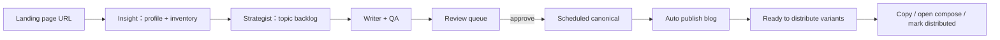

# PRD：CiteLoop 前端 Dashboard（MVP / V1）

> 产品事实来源：`docs/PRD-CiteLoop-MVP-v2.md`
> 设计参考：SuperX Home Dashboard（`https://app.superx.so/home`，已基于登录后的 Chrome 页面观察）
> 目标：把 CiteLoop 做成一个清晰、克制、可执行的 SEO + GEO 内容运营工作台。

## 0. 背景与定位

CiteLoop 前端不是营销落地页，也不是大屏数据看板。它是 SEO + GEO 自动内容引擎的运营控制台：用户在这里完成项目初始化、查看自动化状态、审核内容、处理阻塞、发布正本、分发改写稿。

V1 的第一屏应当像 SuperX Home 一样是一个轻量 workflow dashboard：固定左侧导航、居中的窄内容流、清晰队列、白色卡片、细边框、短动作按钮。整体要让用户快速知道“下一步该做什么”，而不是被大量指标或装饰信息打断。

## 1. 目标

1. 让用户通过一个 landing page URL 启动项目认知流程，并能看到抓取、Profile、Inventory 的结果。
2. 让用户在项目 Home 中理解当前运营状态：未来排期、待审核、已发布、待分发、最近运行、预算/失败/降级状态。
3. 把 `pending_review` 做成唯一且可信的人审闸门；`qa_blocking=true` 的内容必须无法 approve。
4. 支持核心操作：run insight、run strategist、generate topic、edit、save、approve、reject、copy variant、open compose page、mark distributed。
5. 前端尽量贴合现有 API，同时明确列出需要补齐的后端契约，避免设计停留在静态页面。

## 2. 非目标

- V1 不做注册、计费、团队管理、多租户管理后台。
- V1 不做 SEO 排名、AI 引用、share of voice、闭环分析等 analytics 功能。
- V1 不做第三方平台自动发布；站点分发仍是“复制改写稿 + 打开平台 + 人工发布”。
- V1 不做配图、图像生成、素材库。
- V1 不做完整 crawler debug workbench；可以展示抓取边界、抓取结果和失败摘要，但不做逐请求调试器。

## 3. 目标用户与主流程

### 3.1 目标用户

V1 用户是单项目或少量项目的运营者/创始人。他们最关心：

- 系统是否正确理解了产品。
- 哪些选题已经生成、待审核、已排期、已发布。
- 哪些产品事实声明缺少证据映射。
- 哪些 syndication variant 已经解锁，可以手动发到第三方平台。

### 3.2 主流程

## 4. 信息架构

### 4.1 App Shell

使用固定左侧导航 + 居中内容列。页面应当像工作台，而不是宽屏文档。

主导航：

- Home
- Knowledge
- Topics
- Review
- Publishing
- Runs
- Settings

Sidebar 底部区域：

- 月度预算/用量紧凑提示。
- Help/docs 入口。
- Project/account 切换卡片。

### 4.2 路由规划

| Route | 用途 | MVP 优先级 |
|---|---|---|
| `/` | Project list / create project entry | P0 |
| `/projects/[id]` | Home dashboard overview | P0 |
| `/projects/[id]/knowledge` | Product profile + content inventory | P0 |
| `/projects/[id]/topics` | Topic backlog、排期、生成 | P0 |
| `/projects/[id]/review` | 人工审核队列 | P0 |
| `/projects/[id]/publishing` | 已发布正本 + 待分发 variants | P0 |
| `/projects/[id]/runs` | generation runs、降级、成本、失败 | P1 |
| `/projects/[id]/settings` | cadence、buffer、channel mix、crawl、budget | P1 |

## 5. 页面需求

### 5.1 Home

Home 是运营总览。借鉴 SuperX 的 queue + card 结构，不做一堆超大 KPI 卡片。

页面区块顺序：

1. Learning/help 折叠条
   - 类似 SuperX 的 `Show learning resources` 一行入口。
   - 默认折叠。
   - 高度约 `36px`。

2. Next scheduled
   - 按日期分组的队列行。
   - 显示 canonical title、channel、scheduled time、status。
   - 没有内容的排期槽也要显示，让用户能看到 cadence 缺口。
   - 当前后端没有专门的 schedule grid 端点；V1 可由前端根据 `projects.config.cadence_per_week`、`buffer_days`、`topics.scheduled_at`、`articles.scheduled_at` 推导空槽，或在后端新增 `/schedule` 端点作为后续增强。
   - 点击行进入 article/topic detail。

3. Needs review
   - 桌面端两列 masonry card。
   - 卡片显示 title、kind/platform、SEO/GEO score、blocking 状态、短摘要、主动作。
   - blocking 视觉优先级高于 score。

4. Ready to distribute
   - 只有 canonical 已发布且 `canonical_url` 已回填的 variant 才显示。
   - 展示 platform、是否支持 canonical tag、copy、compose link、mark distributed。

5. Recent runs
   - 最近 5 条 generation runs。
   - 展示 agent、status、degraded、cost、created time。
   - 链接到 Runs 页。
   - 依赖新增 runs 读取端点；端点完成前可显示占位/不可用状态，不应伪造数据。

Home 验收：

- 用户在一屏内能判断项目状态。
- 用户能一键进入当前最重要的下一步动作。
- 不使用装饰性 KPI 卡片；每个区块都应服务于具体工作流。
- 空状态明确：no topics、nothing pending review、none ready、no published canonical yet。

### 5.2 Knowledge

目的：让 Insight 输出可核查、可编辑、可被 QA 证据映射引用。

内容：

- Active Product Profile：
  - positioning
  - value props
  - features
  - ICP
  - tone
  - key terms
  - competitors
  - differentiators
- Source URLs + crawl summary：
  - landing URL
  - sitemap 或 fallback path
  - pages crawled / skipped / truncated
  - crawl limits
  - 目前 `POST /insight` 只返回 `{profile, inventory_count}`，没有返回或落库 crawl summary；要完成本区块，需要后端持久化或返回 crawl summary。
- Inventory list：
  - URL、title、target keyword、topics、summary、source、evidence snippets
  - 支持 existing/generated 过滤
  - 支持 title/URL/keyword 搜索

动作：

- 输入 landing page URL 并 run Insight。
- 编辑并保存 profile 字段。
- 编辑 inventory title/keyword/topics/summary。
- 如需人工修正证据映射，还要支持编辑 evidence snippets；当前 `UpdateInventoryItem` 尚不更新该字段，需要扩展后端接口。
- 重新运行 Insight，生成新的 active profile version。
- 打开 source URL。

验收：

- 用户能在生成内容前确认系统对产品的理解。
- inventory row 能看到或进入 evidence snippets，因为 `qa_blocking` 依赖证据映射。
- crawl truncation、抓取失败、降级信息显示在 profile 附近，不藏在日志里。

### 5.3 Topics

目的：管理选题 backlog、排期和单条生成。

内容：

- Topic list/table：
  - title
  - channel
  - priority
  - status
  - scheduled date
  - internal links
- 过滤：
  - channel
  - status
  - priority
  - scheduled / unscheduled
- Upcoming schedule date group。
- Topic detail drawer：
  - target keyword / target prompt
  - angle
  - format
  - internal links
  - related inventory

动作：

- Run Strategist。
- Generate selected topic。
- Archive topic（需要新增 HTTP 路由）。
- 编辑 title、channel、priority（需要新增 query + HTTP 路由）。
- 编辑 scheduled date（已有 `SetTopicScheduledAt` query，但仍需要 HTTP 路由和 client method）。

验收：

- Strategist 产出的 topics 可在生成前被审阅。
- Generate topic 后立即刷新 review queue 状态。
- 如果后端返回已有内容去重或冲突提示，前端必须展示。
- 重复 generate 同一 topic 时，后端必须返回友好结果：返回已有 articles，或返回 `409` + 可展示错误。不能把唯一索引冲突裸露成 `500`。

### 5.4 Review

目的：实现 `docs/PRD-CiteLoop-MVP-v2.md` 中定义的唯一人工闸门。

内容：

- 按 topic 分组。
- 每组 canonical 在前，variants 在后。
- Article card 字段：
  - `seo_meta.title`
  - `kind`
  - `platform`
  - `status`
  - `seo_score`
  - `geo_score`
  - `qa_blocking`
  - `qa_issues`
  - markdown preview/editor
  - SEO metadata editor

动作：

- 展开/编辑 `content_md`。
- 保存 `content_md` / `seo_meta`。
- Approve。
- Reject。

规则：

- `qa_blocking=true` 时 approve 按钮禁用。
- 禁用态旁边展示原因：blocking claims must map to profile or inventory evidence。
- 后端是权威闸门：即使 UI 没有禁用按钮，`POST /approve` 在 `qa_blocking=true` 时也会返回 `409`。前端禁用只是体验层 guard。
- 保存正文时，后端会重跑 QA 并返回新的 `qa_blocking`、`qa_issues`、score；UI 按返回值刷新。
- 仅保存 `seo_meta` 且正文未变化时，不重跑 QA，blocking 状态不变；UI 不应暗示 meta 修改可以解锁 blocking。
- canonical 和 variants 保持同一 topic 分组，方便作为一个 publishing bundle 审核。

验收：

- blocking article 无法 approve。
- approve/reject/edit 后局部刷新，不需要整页重载。
- 长 markdown 编辑不会导致布局跳动或溢出。

### 5.5 Publishing

目的：展示真正发出的 canonical，以及还需要用户手动分发的 variants。

区块：

1. Published canonical
   - status、title、canonical URL、published time、publish result。
   - live article link。
   - publish failed 单独展示，不混入成功列表。

2. Ready to distribute
   - platform。
   - canonical support：
     - Medium / Dev.to / Hashnode / LinkedIn：支持 canonical tag。
     - Reddit / Hacker News 类平台：正文 source link only。
   - variant markdown。
   - copy content。
   - open compose page。
   - mark distributed。

3. Waiting on canonical
   - 已 approved 但 canonical 未 published 或缺少 `canonical_url` 的 variants。
   - 当前没有专用接口；V1 可由 `listArticles(id, "approved")` 客户端过滤 `kind=syndication_variant` 派生。

验收：

- canonical URL 缺失时，variant 绝不显示为 ready。
- Copy action 有成功反馈。
- Mark distributed 不能被误解为自动发布到了第三方平台。

### 5.6 Runs

目的：让自动化可审计，尤其是搜索降级、预算熔断和失败。

内容：

- Generation run list：
  - agent：insight / strategist / writer / qa
  - status：ok / error
  - degraded flag
  - model
  - tokens
  - cost
  - created time
  - error summary
- Strategist run 的 search snapshot preview。
- Monthly budget usage summary。
- 当前后端只有 `InsertGenerationRun`、`MonthlySpend`、`RecentRunFailures` query，没有 `ListGenerationRuns` query，也没有 `GET /runs` HTTP 路由；Runs 页和 Home recent runs 需要新增读取契约。

动作：

- 按 agent/status 过滤。
- 后端支持时可 retry failed run。
- run 产出 topic/article 时，可跳转到关联对象。

验收：

- 用户能区分 failed run、degraded-but-successful run、budget-blocked generation。
- 搜索失败降级和预算停止都不是“静默失败”。

### 5.7 Settings

目的：暴露 `projects.config` 中的项目级配置。

字段：

- cadence per week
- buffer days
- channel mix
- brand voice
- monthly budget USD
- crawl config：
  - same-origin only
  - max pages
  - max depth
  - request timeout
  - rate limit
  - respect robots
  - sitemap URL cap

验收：

- 默认值与后端 config 一致。
- 数字配置使用 input/slider/stepper，并有清晰范围。
- 保存配置不能静默破坏已有排期。
- 当前 `PUT /config` 是整体覆盖。Settings 表单必须发送完整 payload 并做范围校验，或后端改成 merge 到现有 config；否则漏发字段会被存成 `0`，可能把 crawl 边界或 cadence 写坏。

## 6. SuperX 风格参考细节

参考页面整体是“工作流队列型 SaaS dashboard”：固定 sidebar、白色 card、细边框、克制阴影、居中窄内容流。CiteLoop 应借鉴它的排版密度和组件纪律，而不是照搬业务文案。

### 6.1 Layout Metrics

- Body background：`#f5f5f4`，对应 Tailwind `stone-100`。
- Sidebar：
  - fixed left，full height。
  - width：`210px`。
  - horizontal padding：`12px`。
  - background：white。
  - right border：`#e5e7eb` / `gray-200`。
- Main shell：
  - sidebar 预留：left padding 约 `220px`。
  - content wrapper：centered，`max-width: 1024px`。
  - 实际内容宽度：约 `960px`。
  - top padding：`32px`。
  - horizontal padding：mobile `16px`，tablet `24px`，desktop `32px`。
- 优先使用居中的窄内容列和右侧留白，避免全宽 dashboard 的松散感。

### 6.2 Typography

主 UI 字体：

- `Inter`, `"Inter Fallback"`, `system-ui`, `-apple-system`, `Segoe UI`, `Roboto`, `Helvetica Neue`, `Arial`, sans-serif。
- Body default：`16px / 24px`，weight `500`，color `#0f172a` 或对应 neutral/slate token。

内容预览字体：

- Article preview 可使用类似 `TwitterChirp, -apple-system, system-ui, Segoe UI, Roboto, Helvetica, Arial, sans-serif` 的 readable content stack。
- Article card body：`15px / 20px`，weight `500`。
- Article preview 内标题/作者类 label：`15px`，weight `600`。

文字层级：

| Element | Size / Line | Weight | Color |
|---|---:|---:|---|
| Section title | `20px / 28px` | `700` | `slate-900` |
| Card title | `15px-16px / 20px-24px` | `600` | `slate-900` |
| Body copy | `14px-15px / 20px` | `500` | `slate-700` |
| Date/group label | `13px / 19.5px` | `600` | `slate-500` |
| Muted metadata | `12px-13px / 16px-20px` | `500` | `slate-400/500` |
| Nav item | `14px / 20px` | `500`，active `600` | neutral 或 accent |

不要用 viewport width 缩放字号。Letter spacing 保持 `0`。

### 6.3 Color Tokens

基础色：

- Page：`stone-100` / `#f5f5f4`。
- Surface：white。
- Text strong：`slate-900`。
- Text normal：`slate-700`。
- Text muted：`slate-500`。
- Text faint：`slate-400`。
- Border：`slate-200`。
- Hover surface：`slate-50`。

强调色：

- Primary CTA gradient：from `#d93820` to `#f4503b`。
- Primary action text：`#d93820`。
- Informational blue：`#1d9bf0`。
- Success/engage green：`#16a34a`。
- Strategy/settings violet：`#7c3aed`。
- Warning amber：Tailwind `amber-500/700`。
- Error red：Tailwind `red-600/700`。

强调色要少用。大部分界面应由白色 surface、灰色边框和深色文字组成。
`#d93820 → #f4503b` 是按 SuperX 参考提取的强主色；FE1 落地前需要确认它是 CiteLoop 的产品主色，还是只作为临时参考色并替换为最终品牌色。

### 6.4 Sidebar 规格

Primary CTA：

- 文案按当前动作变化，例如 `Run Insight` 或 `Create project`。
- height：`40px`。
- width：`185px`。
- border radius：`12px`。
- padding：`8px`。
- gap：`8px`。
- background：red/orange gradient from `#d93820` to `#f4503b`。
- text：white，`16px / 24px`，weight `500`。

Primary nav item：

- width：`185px`。
- height：`36px`。
- radius：`12px`。
- padding：`4px 8px`。
- gap：`10px`。
- font：`14px / 20px`。
- active state：accent-colored icon/text，weight `600`，不使用重填充 pill。

Secondary nav item：

- indent：约 `34px`。
- width：约 `151px`。
- height：`32px`。
- radius：`8px`。
- padding：`6px 12px`。
- font：`14px / 20px`。

Bottom account card：

- width：`185px`。
- height：约 `52px`。
- background：white。
- radius：`12px`。
- 只在需要分层时使用非常轻的 shadow。

### 6.5 Cards and Rows

Queue row：

- width：填满内容列。
- min height：`38px`。
- background：white。
- border：`1px solid slate-200`。
- radius：`8px`。
- padding：`8px 16px`。
- horizontal gap：`8px`。
- hover：`slate-50`。
- time text：`13px`，`slate-400`。
- main text：`14px / 20px`，单行 truncate。

Review/distribution card：

- desktop：两列布局，gap `12px`。
- background：white。
- border：`1px solid slate-200`。
- radius：`12px`。
- padding：`12px 16px`。
- 不使用重阴影。
- 允许可变高度；长内容可用 masonry/columns 形成自然排布。

Compact discovery/run card：

- desktop 可用三列。
- 宽度约为内容列的三分之一。
- radius：`8px`。
- padding：`16px`。
- border：`1px solid slate-200`。
- hover：`slate-50`。

不要 card 套 card。页面 section 使用未加框的内容区域，card 只用于重复项、modal 或确实需要 framing 的工具。

### 6.6 Buttons and Motion

Small outline button：

- height：约 `30px-32px`。
- radius：`8px-12px`。
- padding：`6px 12px`。
- font：`12px-14px`。
- border：`slate-200`。

Primary action button：

- red/orange gradient。
- radius：`12px`。
- active scale：`0.97`。

Motion：

- transition duration：`75ms`、`100ms`、`150ms` 或 `200ms`。
- easing：`cubic-bezier(0.4, 0, 0.2, 1)`。

图标：

- 常见动作使用 icon button 或 icon + text：refresh、copy、external link、approve、reject、edit、settings。
- 只引入一个 icon library。建议在 FE1 新增并统一使用 `lucide-react`；导入前先确认依赖已安装。
- 不为常见动作手写 SVG。

### 6.7 Interaction States

必须覆盖：

- 每个 dashboard section 的 loading skeleton。
- 指向下一步动作的 empty state。
- API failure error banner。
- mutation button busy state。
- copy、approve、reject、save、mark distributed 的成功反馈。
- blocked approve 的 disabled reason。
- degraded search badge。
- budget stopped badge。
- publish failed badge；如果后端支持 retry，展示 retry。

## 7. Data and API Contracts

### 7.1 当前 `web/app/lib/api.ts` 已暴露

| 需求 | 现有 client method |
|---|---|
| List projects | `api.listProjects()` |
| Get project | `api.getProject(id)` |
| Run Insight | `api.runInsight(id, landingURL)` |
| Run Strategist | `api.runStrategist(id)` |
| List topics | `api.listTopics(id)` |
| Generate topic | `api.generateTopic(id, topicID)` |
| List review queue | `api.listReview(id)` |
| List articles by status | `api.listArticles(id, status)` |
| List ready distribution items | `api.listDistribute(id)` |
| Trigger generate tick | `api.tickGenerate(id)` |
| Trigger publish tick | `api.tickPublish(id)` |
| Approve / reject / edit article | `api.approve` / `api.reject` / `api.edit` |
| Mark distributed | `api.distributed(articleID)` |

### 7.2 后端已存在，但还缺 `api.ts` client method 和 UI

| 需求 | 后端现状 | 前端工作 |
|---|---|---|
| Project create | 已有 `POST /api/projects` | 增加 `api.createProject()` 和 create project 表单 |
| Profile read/update | 已有 `GET /api/projects/{id}/profile`、`PUT /api/projects/{id}/profile` | 增加 `api.getProfile()`、`api.updateProfile()`，接 Knowledge 页 |
| Inventory list/update/delete | 已有 `GET /inventory`、`PUT /inventory/{itemID}`、`DELETE /inventory/{itemID}` | 增加 client methods，接 Inventory list/editor |
| Config read/update | read 已在 `GET /projects/{id}` 的 `config` 字段；update 已有 `PUT /config` | 增加 `api.updateConfig()`，Settings 表单必须发送完整 payload 或等待后端 merge |
| Edit article re-QA | 已有 `PUT /articles/{articleID}/`；正文变化时后端 re-QA | 前端按返回 article 刷新 blocking/issues/scores；仅 meta 变化不暗示 re-QA |
| Approve blocking guard | 已有后端 `409` 闸门 | 前端禁用按钮 + 处理 `409` 错误 |

### 7.3 真正需要补后端的契约

| 需求 | 当前缺口 | 建议 |
|---|---|---|
| Runs list | `runs.sql` 只有 insert/monthly spend/recent failures；没有 `ListGenerationRuns` query 和 `GET /runs` | 新增 `GET /api/projects/{id}/runs?agent=&status=&limit=`，返回 run list、monthly spend、degraded/search snapshot |
| Topic update/archive | 只有 `UpdateTopicStatus`、`SetTopicScheduledAt` query；没有编辑 title/channel/priority 的 query，也没有 HTTP 路由 | 新增 topic patch/archive 路由；至少支持 schedule/status，完整支持 title/channel/priority |
| Article detail | 有 `GetArticle` query，但没有 `GET /articles/{articleID}` HTTP 路由 | 新增 detail route，用于 review/publishing 深链 |
| Publish retry | 没有 retry query/route | 若 UI 要 retry publish failed，新增 retry route；否则只展示失败和日志入口 |
| Crawl summary | `POST /insight` 不返回 sitemap/fallback、crawled/skipped/truncated/errors，也未落库 | 新增返回字段或持久化到 project/profile/run output |
| Schedule grid | 没有空槽接口 | V1 前端推导；后续可新增 `/schedule` 端点 |
| Inventory evidence edit | `UpdateInventoryItem` 不更新 `evidence_snippets` | 如 Knowledge 页要人工修正证据片段，扩展 update payload/query |
| Duplicate topic generation | `generateTopic` 可能把唯一索引冲突暴露成 `500` | 返回已有 articles 或 `409` 友好错误 |

### 7.4 通用响应 DTO 要求

后端目前多处直接返回 sqlc model，前端会收到 pgtype 结构：

- `geo_score` / `seo_score` / `cost_usd` 是 `pgtype.Numeric`，不是普通 number。
- `scheduled_at` / `published_at` / `created_at` 是 `pgtype.Timestamptz`，不是 RFC3339 string。

为了避免每个页面都手写 pgtype 反解，建议后端增加 response DTO：

- score/cost：返回 `number | null`。
- time：返回 `string | null`，格式为 RFC3339。
- `qa_issues`、`seo_meta`、`profile`、`topics`、`source_urls`：返回已解析 JSON，而不是前端自己猜类型。

如果短期不改后端，前端必须在 `web/app/lib/api.ts` 集中做 normalize，不能把 pgtype 解析散落到 card/table 组件里。

## 8. 技术与实现约束

当前本地前端栈：

- Next.js `14.2.15`。
- React `18.3.1`。
- Tailwind CSS `3.4.13`。
- TypeScript `5.6.2`。
- 当前未安装 UI component library 或 icon package。

实现建议：

- 继续使用 Tailwind v3 语法，除非有明确升级计划。
- 在 `globals.css` 或 Tailwind config 中建立小型 design token 层：颜色、radius、typography。
- 使用 `web/app/projects/[id]/...` 下的 route-level pages。
- 初始数据简单时用 server component；mutation-heavy 的队列和编辑区用 client component。
- 在 `api.ts` 集中定义 DTO/normalize 层，处理 pgtype numeric/time，组件只消费干净的 number/string/null。
- MVP 不需要引入完整 UI 框架。先建立少量本地 primitives：`Button`、`Badge`、`SectionHeader`、`QueueRow`、`ArticleCard`、`Sidebar`。
- sidebar item、row、card、icon button、toolbar 都要有稳定尺寸，避免 loading/text 状态造成 layout shift。
- Settings 保存时发送完整 config payload 并做范围校验；在后端改成 merge update 前，不允许部分 payload 静默覆盖配置。

## 9. 前端 PR 拆分建议

| PR | 范围 | 验收 |
|---|---|---|
| FE1 | App shell、sidebar、design tokens、icon library、project list restyle | SuperX-inspired layout 落地；新增 `lucide-react`；不改后端行为 |
| FE2 | Home dashboard overview | scheduled、review、distribute 区块可见；空排期槽由前端推导；runs 端点未完成时显示占位 |
| FE3 | Knowledge page | Run Insight、profile 展示/编辑、inventory list；补 `api.ts` client methods；crawl summary 等待后端契约 |
| FE4 | Topics page | Strategist、topic filters、generate selected topic；topic 编辑/归档按后端契约分阶段开启 |
| FE5 | Review page | topic 分组、edit/save、approve/reject、blocking guard |
| FE6 | Publishing page | published canonical、ready/waiting variants、copy/open/mark distributed |
| FE7 | Runs + Settings | run audit、costs、degraded/budget states、config editing；Runs 依赖新增后端读取端点 |

## 10. 总体验收清单

- UI 明确呈现“review before publishing”这一唯一人工闸门。
- `qa_blocking=true` 的文章无法 approve。
- canonical 未 published 或缺少 `canonical_url` 时，variants 不会进入 ready to distribute。
- Dashboard 使用固定左侧 sidebar + 居中约 `960px` 内容流。
- 字体、颜色、圆角、行、卡片、按钮符合上方 SuperX-inspired token 规格。
- 移动端可用：sidebar 折叠或变成紧凑导航，内容不横向溢出。
- 所有 mutation action 都有 busy、success、error 反馈。
- Empty state 指向下一步有用动作。
- UI 能区分 ok、error、degraded、budget-stopped、blocked、scheduled、published、distributed。
- 组件层消费的是 normalized DTO，不直接解析 `pgtype.Numeric` 或 `pgtype.Timestamptz`。
- Settings 保存不会用部分 payload 把未展示字段写成 `0`。
- 不引入重阴影、嵌套卡片、超大 hero、装饰性渐变或营销式布局。
